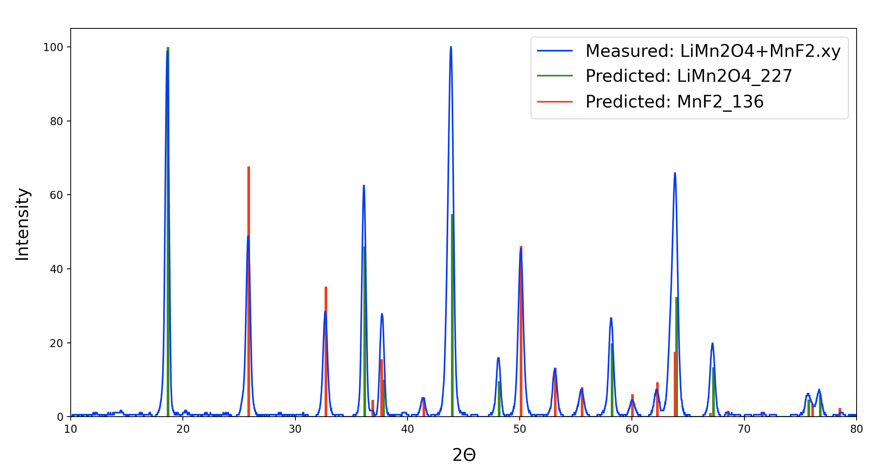

# An automatic analysis tool for XRD

A package designed to automate phase identification from XRD spectra using a probabilistic deep learning model trained with physics-informed data augmentation.

The corresponding manuscript can be found at [Chemistry of Materials](https://pubs.acs.org/doi/full/10.1021/acs.chemmater.1c01071). Reproducing the published results can be accomplished using the data provided in [figshare](https://figshare.com/s/69030545b8020de35633).

We have also recently integrated Pair Distribution Function (PDF) analysis into the package. Further details on the methodology behind this new approach, as well as instructions on how to implement it, are provided at the bottom of this page and in the corresponding manuscript at [npj Computational Materials](https://www.nature.com/articles/s41524-024-01230-9).

## Installation

The package is available on PyPI and can be installed as follows:

```
pip install --user autoXRD
```

## Usage example

A pre-trained model for the Li-Mn-Ti-O-F chemical space is available in the ```Example/``` directory. To classify the experimental patterns in the ```Spectra/``` sub-folder, run the following:

```
python run_CNN.py
```

The process should take about 1-2 minutes. Runtime is typically ~10 seconds per spectrum on a single CPU, but may vary from system to system. Parallelization is also possible, and all available CPU will be utilized by default. GPU can also be used for the training and inference steps.

Once all spectra have been classified, each set of predicted phases will be printed along with their associated probabilities (%). These represent the confidence associated with each predicted phase. Generally, higher values of confidence are associated with more reliable predictions.

## Training the model for new compositions

To develop a model that can be used to perform phase identification in a new chemical space, place all relevant CIFs into ```Novel_Space/All_CIFs```. Then navigate to the ```Novel_Space/```directory and execute:

```
python construct_xrd_model.py
```

This script will:

1) Filter all unique phases from the provided CIFs. Alternatively, to provide a customized set of reference phases without filtering, place all CIFs into a folder labeled ```References``` and run ```python construct_xrd_model.py --skip_filter```. Note that once a model is trained, you should **not** modify the References folder by adding or removing any files.

2) If ```--include_ns``` is specified: generate hypothetical solid solutions between the stoichiometric phases.

3) Simulate augmented XRD spectra from the phases produced by (1) and (2).

4) Train a convolutional neural network on the augmented spectra.

In cases where the user supplies many possible reference phases to may or may not be reasonably accessible under common experimental conditions, it is often useful to exclude any compounds that place elements in unusual oxidation states. This can be done by adding the option:

```
python construct_xrd_model.py --oxi_filter
```

By default, training spectra will be simulated over 2θ spanning 10-80 degrees (assuming Cu K-alpha radiation). However, this can be customized as follows:

```
python construct_xrd_model.py --min_angle=10.0 --max_angle=80.0
```

Different X-ray wavelengths may also be considered, but this should only be specified at inference. All patterns will be converted back to Cu K-alpha.

The model creation process may require a substantial amount of computational resources depending on the size of the composition space considered. For example: performing all necessary steps to create a model in the Li-Mn-Ti-O-F space, which included 255 reference phases, required about 4 hours of computational runtime on a single core. Required computational time should scale linearly with the number of reference phases. Similarily, time is reduced linearly with the number of cores used as all processes executed here are perfectly parallel (independent of one another).

When the procedure is completed, a trained ```Model.h5``` file will be made available. 

By default, the following bounds are used on artifacts included during data augmentation:

* Peak shifts (non-uniform): up to +/- 3% strain applied to each lattice parameter
* Peak shifts (uniform): up to +/- 0.5 degrees shift in all peak positions due to sample height error
* Peak broadening: domain size ranging from 5-30 nm
* Peak intensity variation: texture causing as much as +/- 50% change in peak height
* Impurity peaks: up to 70% of the maximum peak height

However, custom bounds can also be specified, e.g., as follows:

```
python construct_xrd_model.py --max_strain=0.04 --max_shift=1.0 --min_domain_size=1.0 --max_domain_size=100.0 --max_texture=0.5 --impur_amt=70.0
```

Training is performed for 50 epochs, which is generally sufficient to achieve convergence without overfitting. However, this may also be tuned by the user:

```
python construct_xrd_model.py --num_epochs=50
```

## Characterizing multi-phase spectra

In the directory containing ```Model.h5```, place all spectra to be classified in the ```Spectra/``` folder. These files should be in ```xy``` format (two-column data).

Once all files are placed in the ```Spectra/``` folder, they can be classified by executing:

```
python run_CNN.py
```

Output will appear as:

```
Filename: (name of the spectrum)
Predicted phases: (phase_1 + phase_2 + ...)
Confidence: (probabilities associated with the phases above)
```

Phase labels are denoted as ```formula_spacegroup```.

By default, only phases with a confidence above 40% will be shown. To raise or lower the minimum confidence, one may specify a new bound using the ```--min_conf``` argument at runtime. Use this option with caution, as low-confidence phases are generally not reliable.

If spectra with a range of 2θ other than 10-80 degrees are considered, then the minimum and maximum diffraction angles (in Cu K-alpha) should be specified manually as shown below. Note: this range must match the range used during model creation (see section above).

```
python run_CNN.py --min_angle=10.0 --max_angle=80.0
```

The model assumes that spectra are measured using Cu K-alpha radiation. However, the user can specify any arbitary wavelength (```lambda```, in angstroms) as follows:

```
python run_CNN.py --wavelength=lambda
```

For each spectrum, the phase identification algorithm runs until either (i) a maximum of three unique compounds have been identified, or (ii) all peaks with intensities greater than or equal to 5% of the spectrum's maximum intensity have been identified. To change these parameters (denoted ```N``` and ```I```), the following arguments can be specified:

```
python run_CNN.py --max_phases=N --cutoff_intensity=I
```

To plot the line profiles of the predicted phases in the measured spectrum for comparison, the ```--plot``` option may also be used:

```
python run_CNN.py --plot
```

Which will yield a plot of the form:



By default, all plots will be shown to the user and then discarded. However, they may instead be saved as png files with the following options:

```
python run_CNN.py --plot --save
```

To obtain the weight fraction of each compound in a multi-phase sample using automated Rietveld refinement, the ```--weights``` argument can be used:

```
python run_CNN.py --weights
```

Which will provide an additional line in the output:

```
Filename: (name of the spectrum)
Predicted phases: (phase_1 + phase_2 + ...)
Confidence: (probabilities associated with the phases above)
Weight fractions: (weight fraction associated with each phase above)
```

If the user wishes to compare specific reference phases to the measured spectrum, the ```visualize.py``` script can be used as follows:

```
python visualize.py --spectrum='filename' --ph='cmpd1_sg' --ph='cmpd2_sg'
```

Where ```cmpd1_sg``` and ```cmpd2_sg``` refer to the phases that will be fit to the spectrum and plotted. Note that minimum and maximum angles, as well as the wavelength, must also be specified if they differ from default values.

## Unknown peaks

In cases where not all peaks can be attributed to known phases in the training set, the following messsage will appear:

```
WARNING: some peaks (I ~ X%) were not identified.
```

Where ```X%``` represents the maximum intensity of the peaks that were not able to be identified. These peaks can be visualized by adding the ```--show_reduced``` argument at runtime (with ```--plot```). This will show the reduced spectrum (as a yellow dashed line), obtained by subtracting the peaks associated with all known phases.

By default, the warning message will appear when unknown peaks remain with intensities that exceed 25% of the initial maximum. This cutoff may be changed using the ```--unknown_thresh``` option.

## Pair distribution functions

To achieve more accurate phase identification, the user can train two models: one on simulated XRD patterns and another on virtual PDFs computed through a Fourier transform of those XRD patterns. This can be accomplished by first training an XRD model using the procedure described above, and then training a second model on PDFs with the following command:

```
python construct_pdf_model.py
```

This assumes an XRD model has already been trained and exists in the current directory as ```Model.h5```. It also assumes that CIF filtering has already taken place, and therefore a ```References``` folder exists in the current directory. When training a PDF model, all the same arguments should be specified (radiation wavelength, scan range, and artifact magnitudes) as those given during XRD training, with the exception of any arguments related to CIF filtering.

Once training is finished, two files named ```XRD_Model.h5``` and ```PDF_Model.h5``` will be placed in a ```Models``` folder. This folder should be present in any directory where the user wishes to analyze new patterns.

Following a similar procedure as described above for standalone XRD analysis, both models can now be applied to perform phase identification based on XRD patterns placed in the ```Spectra``` folder. To ensure both models are used, the ```--inc_pdf``` flag should be specified at runtime:

```
python run_CNN.py --inc_pdf
```

This will yield predictions that are derived from a confidence-weighted sum of the predicted phases from both models trained on XRD patterns and virtual PDFs. By default, only the merged predictions will be shown. However, the user can choose to show predictions from each individual method by specifying:

```
python run_CNN.py --inc_pdf --show_indiv
```

All other runtime arguments described in the previous section hold for PDF analysis.

